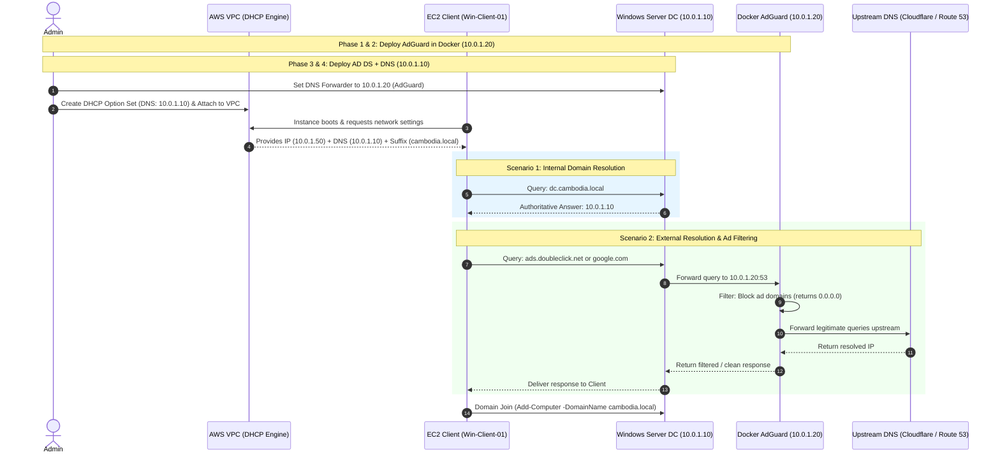

# Full Implementation Guide: Windows Active Directory, DNS & AdGuard Home (Docker) on AWS

This guide provides complete, production-grade instructions to build the end-to-end environment on AWS:
1. Setting up the AWS VPC and Subnets.
2. Launching and configuring an **AdGuard Home** container using Docker on Linux.
3. Deploying a Windows Server EC2 instance as an **Active Directory Domain Controller and DNS Server**.
4. Linking Windows DNS Forwarders to the AdGuard Home Docker instance (**Architecture A**).
5. Setting up **AWS VPC DHCP Option Sets** to automatically distribute the setup to client instances.
6. Verifying domain join, DNS resolution, and ad-filtering from a client machine.

---

## Architecture Flow Overview



---

## Phase 1: AWS VPC & Network Infrastructure Setup

### 1. Create the VPC
1. Open the **AWS VPC Console** > **Your VPCs** > **Create VPC**.
2. Settings:
   * **Name tag:** `lab-ad-vpc`
   * **IPv4 CIDR block:** `10.0.0.0/16`
3. Click **Create VPC**.

### 2. Create the Subnet
1. Go to **Subnets** > **Create subnet**.
2. Settings:
   * **VPC:** Select `lab-ad-vpc`
   * **Subnet name:** `lab-private-subnet-a`
   * **Availability Zone:** Choose any (e.g., `ap-southeast-1a`)
   * **IPv4 CIDR block:** `10.0.1.0/24`
3. Click **Create subnet**.

---

## Phase 2: Deploy AdGuard Home on Docker (Linux EC2)

### 1. Create AdGuard Security Group (`sg-adguard-docker`)
Create a Security Group with the following inbound rules:
* **Port 53 (UDP & TCP):** Source `10.0.1.10/32` (Only the Windows Domain Controller needs to send DNS queries here).
* **Port 3000 & 80 (TCP):** Source `My IP` (For web administrative dashboard access).
* **Port 22 (TCP):** Source `My IP` (SSH management).

### 2. Launch the Linux EC2 Instance
1. In the **EC2 Console**, launch an instance with **Amazon Linux 2023** or **Ubuntu 24.04 LTS**.
2. **Instance type:** `t3.micro` or `t3.small`.
3. Under **Network settings**:
   * **VPC:** `lab-ad-vpc`
   * **Subnet:** `lab-private-subnet-a`
   * **Primary IP (Static ENI):** Specify **`10.0.1.20`**.
   * **Security Group:** Select `sg-adguard-docker`.
4. Launch and connect via SSH.

### 3. Install Docker and Deploy AdGuard Home
Run the following commands on your Linux instance:

```bash
# Update system and install Docker
sudo dnf update -y
sudo dnf install -y docker
sudo systemctl enable --now docker
sudo usermod -aG docker ec2-user

# Create persistent storage directories
sudo mkdir -p /opt/adguardhome/work /opt/adguardhome/conf

# Run AdGuard Home container
sudo docker run -d \
  --name adguard-home \
  --restart unless-stopped \
  -v /opt/adguardhome/work:/opt/adguardhome/work \
  -v /opt/adguardhome/conf:/opt/adguardhome/conf \
  -p 53:53/tcp -p 53:53/udp \
  -p 3000:3000/tcp \
  -p 80:80/tcp \
  adguard/adguardhome:latest
```

### 4. Complete AdGuard Initial Setup Wizard
1. Open your browser and navigate to: `http://<Docker-Public-Or-Private-IP>:3000`
2. Follow the setup wizard:
   * **Admin Web Interface:** Set to listen on port `80` (or `3000`).
   * **DNS Server:** Set to listen on `0.0.0.0:53` (All interfaces).
   * Create your admin username and password.
3. Log into the AdGuard Dashboard:
   * Go to **Settings** > **DNS settings**.
   * Under **Upstream DNS servers**, specify your preferred public resolvers or AWS VPC resolver:
     ```text
     https://dns.cloudflare.com/dns-query
     1.1.1.1
     10.0.0.2
     ```
   * Click **Apply**.

---

## Phase 3: Launch & Promote Windows Domain Controller

### 1. Create Domain Controller Security Group (`sg-domain-controller`)
Add inbound rules for VPC traffic (Source: `10.0.0.0/16`):
* **DNS (UDP/TCP):** Port `53`
* **Kerberos (UDP/TCP):** Port `88`
* **LDAP (TCP/UDP):** Port `389`
* **SMB (TCP):** Port `445`
* **RPC Endpoint Mapper (TCP):** Port `135`
* **Dynamic RPC Ports (TCP):** Ports `49152 - 65535`
* **RDP (TCP 3389):** Restricted to your management IP.

### 2. Launch Windows Server EC2
1. Launch an EC2 instance with **Microsoft Windows Server 2022 Base**.
2. **Instance type:** `t3.medium`.
3. Under **Network settings**:
   * **VPC:** `lab-ad-vpc`
   * **Subnet:** `lab-private-subnet-a`
   * **Primary IP (Static ENI):** Specify **`10.0.1.10`**.
   * **Security Group:** Select `sg-domain-controller`.
4. Decrypt password and connect via RDP.

### 3. Install AD DS & DNS Roles
Open PowerShell as Administrator on the Windows Server:

```powershell
# 1. Install Windows Features
Install-WindowsFeature -Name AD-Domain-Services, DNS -IncludeManagementTools

# 2. Promote to new Forest / Domain Controller
$domainName = "cambodia.local"
$safeModePassword = ConvertTo-SecureString "P@ssw0rdLab2026!" -AsPlainText -Force

Install-ADDSForest `
    -DomainName $domainName `
    -DomainNetbiosName "CAMBODIA" `
    -InstallDns:$true `
    -SafeModeAdministratorPassword $safeModePassword `
    -Force:$true
```
*The server will reboot automatically.*

---

## Phase 4: Configure Windows DNS Forwarders to Point to AdGuard

Once the Domain Controller restarts:
1. Log into the DC via RDP.
2. Open PowerShell as Administrator and configure the DNS Forwarder to forward all unresolved external queries to the **AdGuard Docker host (`10.0.1.20`)**:

```powershell
# Remove existing root hints/forwarders and set AdGuard IP as primary forwarder
Set-DnsServerForwarder -IPAddress 10.0.1.20 -PassThru
```

*(Alternatively via GUI)*:
* Open **DNS Manager** (`dnsmgmt.msc`).
* Right-click your server node > **Properties** > **Forwarders** tab.
* Click **Edit**, enter `10.0.1.20`, and click **OK**.

---

## Phase 5: Configure AWS VPC DHCP Option Sets

We now instruct AWS VPC to tell all member EC2 instances that their primary DNS is `10.0.1.10` (Windows DC):

1. Go to the **AWS VPC Console** > **DHCP option sets** > **Create DHCP option set**.
2. Configure:
   * **Name tag:** `dopt-cambodia-adguard`
   * **Domain name:** `cambodia.local`
   * **Domain name servers:** `10.0.1.10`
3. Click **Create DHCP option set**.
4. Attach to the VPC:
   * Go to **Your VPCs** > Select `lab-ad-vpc`.
   * Click **Actions** > **Edit VPC settings** (or **Edit DHCP option set**).
   * Change DHCP option set to `dopt-cambodia-adguard`.
   * Click **Save**.

---

## Phase 6: Client Verification & Domain Join

### 1. Launch a Member Client Instance
* Launch a Windows 10/11 or Windows Server instance (`Win-Client-01`) in `lab-private-subnet-a`.
* Leave its network adapter set to default DHCP.

### 2. Verify Network Leases on Client
Log into `Win-Client-01` and run:

```powershell
ipconfig /all
```

**Verification Checklist:**
* **IPv4 Address:** `10.0.1.x` (Assigned by AWS VPC)
* **Primary Connection-Specific DNS Suffix:** `cambodia.local`
* **DNS Servers:** `10.0.1.10`

### 3. Verify DNS and Ad-Filtering
Run the following test queries:

```powershell
# Test 1: Internal Active Directory Resolution
nslookup dc-server-01.cambodia.local
# Expected: Returns 10.0.1.10 from Windows DNS

# Test 2: External Web Resolution
nslookup google.com
# Expected: Resolves public IP via AdGuard -> Upstream

# Test 3: Ad-block Filtering Test
nslookup doubleclick.net
# Expected: Resolves to 0.0.0.0 (Blocked by AdGuard!)
```

Check your **AdGuard Web Dashboard** (`http://10.0.1.20`). You will see query statistics reflecting the forwarded requests from Windows Server.

### 4. Join the Domain
```powershell
Add-Computer -DomainName "cambodia.local" -Credential (Get-Credential) -Restart
```
Enter `cambodia\Administrator` and its password. The client machine will join the domain and restart automatically.
