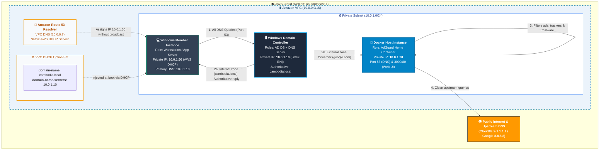

# AWS Windows Active Directory, DNS & AdGuard Home (Docker) Architecture Guide

## 1. Executive Summary & Design Principle

When architecting a modern, enterprise-grade hybrid environment on **Amazon Web Services (AWS)** that integrates **Windows Active Directory Domain Services (AD DS)**, **Windows DNS**, and **AdGuard Home (Docker)** for network-wide ad and tracker filtering:

* **Layer 2 Broadcasts & DHCP:** AWS VPC natively manages IP allocation and network settings via **VPC DHCP Option Sets**. In-guest Windows DHCP server roles are not supported natively on AWS VPC.
* **Internal Resolution & Active Directory:** Windows Server hosts the primary authoritative DNS zones (`cambodia.local`, `_msdcs`). Clients query Windows Server directly to preserve domain logon, Dynamic DNS (RFC 2136), and Kerberos authentication.
* **External Resolution & Security Filtering (Architecture A - Recommended):** Windows DNS does not resolve public traffic directly; instead, it uses **DNS Forwarders** pointing to the **AdGuard Home container running in Docker**. AdGuard Home strips malware, ads, and telemetry, then queries upstream public resolvers (e.g., Cloudflare `1.1.1.1` or AWS Route 53 Resolver `10.0.0.2`).

---

## 2. Architecture Diagram

---

## 3. Query Flow Breakdown (Architecture A)

| Step | Initiator | Target | Protocol / Port | Description |
| :---: | :--- | :--- | :--- | :--- |
| **1** | **Client (10.0.1.50)** | **DC (10.0.1.10)** | UDP/TCP 53 | Client always queries Windows DC directly (configured by VPC DHCP Option Set). |
| **2A** | **DC (10.0.1.10)** | **Client (10.0.1.50)** | UDP/TCP 53 | If query matches `cambodia.local` or `_msdcs`, DC resolves it internally immediately. |
| **2B** | **DC (10.0.1.10)** | **AdGuard (10.0.1.20)** | UDP/TCP 53 | If query is external (e.g. `youtube.com`), DC forwards it to AdGuard Home. |
| **3** | **AdGuard (10.0.1.20)** | **Internal Filter Engine** | Internal | AdGuard checks query against blocklists. If blocked, returns `0.0.0.0`. |
| **4** | **AdGuard (10.0.1.20)** | **Upstream (1.1.1.1 / 10.0.0.2)** | UDP 53 / DoH / DoT | Allowed requests are forwarded upstream to public resolvers or Route 53. |
| **5** | **AdGuard** $\rightarrow$ **DC** $\rightarrow$ **Client** | — | UDP/TCP 53 | Clean resolved IP address is returned back to the client machine. |

---

## 4. Key Advantages of Architecture A

1. **Zero Domain Join Failures:** Active Directory relies extensively on hidden SRV records (`_ldap._tcp`, `_kerberos._udp`). Windows DNS handles these directly without third-party interference.
2. **Native Dynamic DNS (DDNS):** When new Windows instances boot, their computer names and IPs automatically register into Windows DNS Manager via RFC 2136.
3. **High Reliability / Fault Tolerance:** If the AdGuard Docker container is stopped or restarted, local domain logins, file shares, and Kerberos continue operating without interruption.
4. **Centralized Ad-Blocking:** Every device on the network automatically receives filtered external DNS without needing local browser extensions or agent software.

---

## 5. Security & Port Requirements (Security Groups)

### 5.1. Domain Controller (`sg-domain-controller`)
* **Inbound from VPC (`10.0.0.0/16`):**
  * DNS: Port `53` (UDP/TCP)
  * Kerberos: Port `88` (UDP/TCP)
  * LDAP / LDAPS: Port `389` / `636` (TCP/UDP)
  * SMB: Port `445` (TCP)
  * RPC Endpoint Mapper: Port `135` (TCP)
  * Dynamic RPC: Ports `49152 - 65535` (TCP)

### 5.2. Docker Host with AdGuard (`sg-adguard-docker`)
* **Inbound from Domain Controller (`10.0.1.10/32`):**
  * DNS: Port `53` (UDP/TCP)
* **Inbound from Admin IP / Bastion:**
  * Web Management UI: Port `80` / `3000` (TCP)
  * SSH / Admin Access: Port `22` (TCP)
* **Outbound to Internet (`0.0.0.0/0`):**
  * DNS / DoT / DoH: Ports `53`, `853`, `443` (UDP/TCP)
