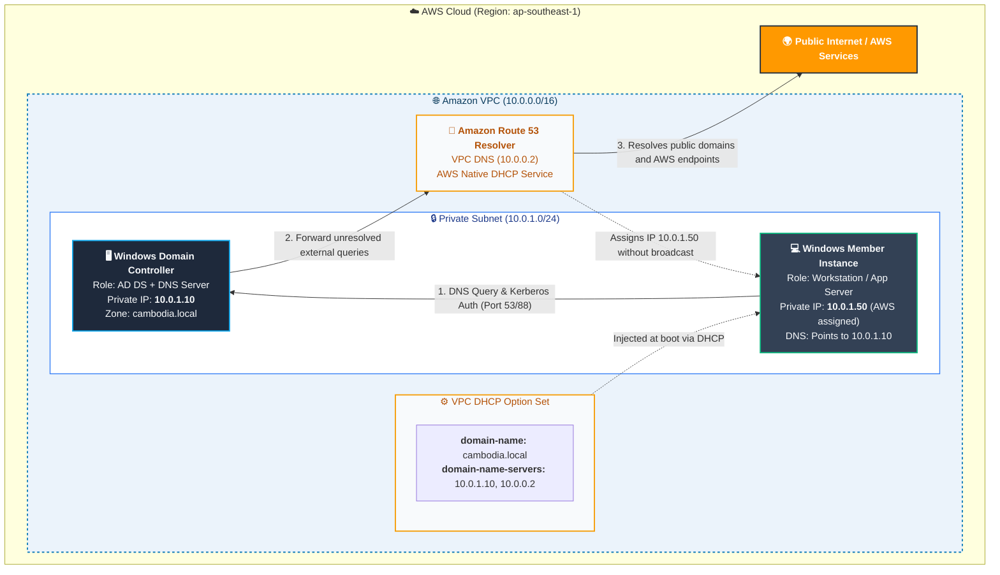

# AWS Windows Active Directory & DNS Architecture Guide

## 1. Executive Summary & Design Principle

When transitioning from an on-premises or VMware Workstation environment to **Amazon Web Services (AWS)**, traditional Layer 2 networking assumptions no longer apply:

* **In VMware Workstation / Physical LAN:** Windows Server handles IP assignment (via DHCP broadcast queries `255.255.255.255`), DNS name resolution, and domain authentication.
* **In AWS VPC:** AWS disables Layer 2 broadcast/multicast at the hypervisor level. AWS natively manages IP assignment across all subnets. 

The industry standard architecture is:
1. **IP Address Management (IPAM / DHCP):** Handled natively by **AWS VPC**.
2. **Domain Controller & DNS Resolution:** Handled by **Windows Server EC2 (Active Directory Domain Services + DNS)**.
3. **Glue Layer (Linking AWS DHCP to Windows DNS):** Configured via **AWS VPC DHCP Option Sets**.

---

## 2. Architecture Diagram

---

## 3. Core Components Breakdown

### 3.1. AWS VPC & Subnetting
* **CIDR Block:** `10.0.0.0/16` (allows scaling).
* **Reserved IP Addresses:** In any AWS subnet, AWS reserves the first four IP addresses and the last IP address. For subnet `10.0.1.0/24`:
  * `10.0.1.0`: Network address.
  * `10.0.1.1`: VPC router.
  * `10.0.1.2`: Reserved by AWS for DNS (AmazonProvidedDNS / Route 53 Resolver).
  * `10.0.1.3`: Reserved by AWS for future use.
  * `10.0.1.255`: Network broadcast address.
* **Domain Controller Placement:** Allocate a static private IP inside the subnet (e.g., `10.0.1.10`).

### 3.2. Windows Active Directory Domain Services (AD DS)
* **Domain Name:** `cambodia.local` (or internal corporate FQDN).
* **FSMO Roles:** Installed on the primary EC2 DC instance.
* **Active Directory Integrated DNS:**
  * Zone files are stored directly inside Active Directory and replicated automatically if a secondary Domain Controller is added.
  * Dynamic updates are secured to domain members.

### 3.3. Hybrid DNS Flow & Forwarders
* When a domain client queries `server1.cambodia.local`:
  1. The client queries `10.0.1.10` directly.
  2. Windows DNS answers with the internal A record.
* When a client queries an external internet address (e.g., `google.com`) or an AWS internal endpoint (`s3.amazonaws.com`):
  1. The client queries `10.0.1.10`.
  2. The Windows DNS server uses **DNS Forwarders** pointing to `10.0.0.2` (the VPC AmazonProvidedDNS resolver).
  3. AWS resolves the internet or AWS internal endpoint name and returns the answer.

### 3.4. AWS DHCP Option Sets
* AWS provides native IP addressing via its hypervisor.
* By customizing the **DHCP Option Set**, you inject custom network configurations into every newly launched EC2 instance:
  * `domain-name-servers`: Points to `10.0.1.10` (Windows DC) and optionally `10.0.0.2` (fallback).
  * `domain-name`: Appends `cambodia.local` as the default DNS search suffix.

---

## 4. Security & Port Requirements (Security Groups)

The following firewall ports must be open in the Domain Controller’s AWS Security Group for intra-VPC communication:

| Traffic Type | Protocol | Port(s) | Purpose |
| :--- | :--- | :--- | :--- |
| **DNS** | UDP / TCP | 53 | Name resolution |
| **Kerberos** | UDP / TCP | 88 | Authentication |
| **RPC Endpoint Mapper** | TCP | 135 | Domain discovery & services |
| **LDAP** | TCP / UDP | 389 | Directory search |
| **LDAPS** | TCP | 636 | Secure Directory search |
| **SMB / CIFS** | TCP | 445 | SYSVOL & Group Policy |
| **Kerberos Password** | TCP / UDP | 464 | Password reset |
| **Global Catalog** | TCP | 3268 / 3269 | Multi-domain forest queries |
| **RPC Dynamic Ports** | TCP | 49152 - 65535 | Active Directory RPC communication |
| **RDP (Admin Only)** | TCP | 3389 | Remote server management (bastion/VPN only) |

---

## 5. Architectural Comparison: VMware vs. AWS

| Feature | On-Premises / VMware Workstation | AWS VPC Enterprise Pattern |
| :--- | :--- | :--- |
| **Hypervisor Broadcast** | Supported (standard Layer 2 switch) | Dropped (Layer 3 software-defined network) |
| **DHCP Server Role** | Installed on Windows Server | Provided natively by AWS VPC |
| **Static IP Assignment** | Configured manually in Windows Network Adapter | Assigned via AWS Management Console / ENI properties |
| **Secondary DC / HA** | Configured in separate VM / Host | Deployed in a separate **Availability Zone (AZ)** |
| **External Forwarding** | Configured to ISP DNS or `8.8.8.8` | Configured to `10.0.0.2` (AmazonProvidedDNS) |
