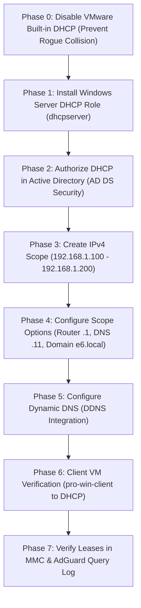

# Enterprise DHCP Server Implementation Guide

**Document Version:** 1.0  
**Target Environment:** Windows Server 2022 Datacenter, Active Directory Domain Services (`e6.local`)  
**Network Subnet:** `192.168.1.0/24` (VMware Virtual NAT `VMnet8`)  
**Author:** Network & Systems Engineering Class (Year 4)

---

## Overview & Workflow Roadmap

This implementation guide provides complete, battle-tested step-by-step instructions (both Graphical User Interface and PowerShell) to deploy an enterprise-grade Windows DHCP Server integrated with our Two-Tier DNS Architecture (`192.168.1.10` Windows DNS + `192.168.1.11` AdGuard Home Docker).



---

## Master Subnet & IP Pool Reference (`192.168.1.0/24`)

| Network Parameter | Value | Description |
| :--- | :--- | :--- |
| **Subnet ID** | `192.168.1.0` | Class C private network |
| **Subnet Mask** | `255.255.255.0` (`/24`) | 256 total IP addresses |
| **Default Gateway** | `192.168.1.1` | VMware Virtual NAT Router (`vmnat.exe`) |
| **Windows Server (AD DC)** | `192.168.1.10` | Domain Controller, Windows DNS, DHCP Server |
| **AdGuard Home (Docker)** | `192.168.1.11` | Network-wide ad blocker & Cloudflare DoH |
| **Static Server Pool** | `192.168.1.12` - `192.168.1.99` | Excluded from DHCP (infrastructure servers) |
| **DHCP Distribution Pool** | **`192.168.1.100` - `192.168.1.200`** | **Dynamic IP leasing range for client VMs** |
| **Scope Option 003 (Router)**| `192.168.1.1` | Assigned to all DHCP clients |
| **Scope Option 006 (DNS)** | **`192.168.1.11`** | **Assigned to all DHCP clients (AdGuard)** |
| **Scope Option 015 (Domain)** | `e6.local` | Search suffix for Active Directory |
| **Lease Duration** | `8 days` (Default) | Standard enterprise lease |

---

## Phase 0: Disable VMware Workstation Built-in DHCP (Critical!)

> [!CAUTION]
> **Why this step is mandatory:**  
> VMware Workstation includes its own virtual DHCP server (`vmnetdhcp.exe`) on `VMnet8`. If you run Windows Server DHCP while VMware's DHCP is active, a **DHCP Race Condition** occurs. Whichever server replies first gives the client its IP. If VMware wins, the client receives VMware's DNS (`192.168.1.2`), completely bypassing AdGuard and breaking Active Directory domain resolution!

### Execution Steps (On Host Laptop: Windows 11):

1. On your physical host machine (Windows 11), open the Start Menu and type:  
   **Virtual Network Editor** (Run as Administrator).
2. Click **Change Settings** at the bottom-right (shield icon) to grant Administrator privileges.
3. In the top table, select **`VMnet8` (NAT)**.
4. At the bottom, look for the checkbox:  
   ❌ **Uncheck: "Use local DHCP service to distribute IP address to VMs"**.
5. Click **Apply**, then click **OK**.

*(Alternative via Windows 11 Host Services: Open `services.msc` ➔ locate **VMware DHCP Service** ➔ Right-click ➔ **Stop**, and set Startup type to **Disabled**).*

---

## Phase 1: Install DHCP Server Role on Windows Server 2022

Perform these steps inside your **Windows Server VM (`pro-win-server`)**:

### Option A: Via PowerShell (Fastest)

Open PowerShell as Administrator:
```powershell
# Install the DHCP server role and RSAT management tools
Install-WindowsFeature -Name DHCP -IncludeManagementTools

# Verify installation status
Get-WindowsFeature -Name DHCP
```

---

### Option B: Via Server Manager GUI

1. Open **Server Manager** ➔ Click **Manage** (top-right) ➔ Select **Add Roles and Features**.
2. Click **Next** until you reach the **Server Roles** page.
3. Check the box for **DHCP Server**.
4. In the popup window (*Add features that are required for DHCP Server?*), click **Add Features**.
5. Click **Next** ➔ **Next** ➔ **Next** ➔ Click **Install**.
6. When the installation finishes, click **Close**.

---

## Phase 2: Authorize DHCP Server in Active Directory (AD DS)

> [!NOTE]
> In an Active Directory forest, an unauthorized DHCP server is treated as a rogue device and will refuse to distribute IP leases. You must authorize the DHCP server in Active Directory.

### Option A: Via PowerShell

```powershell
# Add DHCP security groups
netsh dhcp add securitygroups

# Restart the DHCP service to apply security group membership
Restart-Service dhcpserver

# Authorize this server in Active Directory forest (e6.local)
Add-DhcpServerInDC -DnsName WIN-J17IMHCEMA9.e6.local -IPAddress 192.168.1.10

# Verify authorization
Get-DhcpServerInDC
```

---

### Option B: Via Server Manager GUI

1. In **Server Manager**, look at the top-right notification flag (yellow exclamation mark ⚠️).
2. Click the notification ➔ Click **"Complete DHCP configuration"**.
3. In the DHCP Post-Install configuration wizard:
   * **Description page:** Click **Next**.
   * **Authorization page:** Select **"Use the following user's credentials"** (should show `E6\Administrator`) ➔ Click **Commit**.
4. Click **Close**.

---

## Phase 3: Create IPv4 DHCP Scope (`192.168.1.0/24`)

We will create a scope named **`E6-Clients-Scope`** distributing IPs from `192.168.1.100` to `192.168.1.200`.

### Option A: Via PowerShell

```powershell
# Create the DHCP Scope
Add-DhcpServerv4Scope -Name "E6-Clients-Scope" `
    -StartRange 192.168.1.100 `
    -EndRange 192.168.1.200 `
    -SubnetMask 255.255.255.0 `
    -State Active `
    -LeaseDuration (New-TimeSpan -Days 8) `
    -Description "Scope for lab client virtual machines"
```

---

### Option B: Via DHCP Management Console GUI (`dhcpmgmt.msc`)

1. Press `Win + R` ➔ type **`dhcpmgmt.msc`** ➔ press **Enter**.
2. In the left tree, expand your server name: **`WIN-J17IMHCEMA9.e6.local`**.
3. Right-click **IPv4** ➔ Select **New Scope...**.
4. Click **Next** on the welcome screen.
5. **Scope Name:**
   * **Name:** `E6-Clients-Scope`
   * **Description:** `Scope for lab client virtual machines`
   * Click **Next**.
6. **IP Address Range:**
   * **Start IP address:** `192.168.1.100`
   * **End IP address:** `192.168.1.200`
   * **Length:** `24`
   * **Subnet mask:** `255.255.255.0`
   * Click **Next**.
7. **Add Exclusions and Delay:**
   * Leave blank (our range already starts at `.100`, excluding our `.1` to `.99` static infrastructure) ➔ Click **Next**.
8. **Lease Duration:**
   * Leave default (`8 Days`) ➔ Click **Next**.
9. **Configure DHCP Options:**
   * Select **"Yes, I want to configure these options now"** ➔ Click **Next**.

---

## Phase 4: Configure Scope Options (Router, DNS, Domain)

This is the most critical configuration phase that connects DHCP to AdGuard Home.

### 1. Scope Option Settings Table

| Option Code | Parameter Name | Setting Value | Purpose |
| :---: | :--- | :--- | :--- |
| **`003`** | **Router (Default Gateway)** | `192.168.1.1` | VMware Virtual NAT Gateway |
| **`006`** | **DNS Servers** | **`192.168.1.11`** | **AdGuard Home Container (Port 53)** |
| **`015`** | **Domain Name** | `e6.local` | Primary Active Directory DNS Suffix |

---

### Option A: Via PowerShell

```powershell
# Set Router (Gateway) -> 192.168.1.1
Set-DhcpServerv4OptionValue -ScopeId 192.168.1.0 -OptionId 3 -Value "192.168.1.1"

# Set DNS Server -> 192.168.1.11 (AdGuard Home)
Set-DhcpServerv4OptionValue -ScopeId 192.168.1.0 -OptionId 6 -Value "192.168.1.11"

# Set Domain Name (DNS Suffix) -> e6.local
Set-DhcpServerv4OptionValue -ScopeId 192.168.1.0 -OptionId 15 -Value "e6.local"
```

---

### Option B: Via GUI (Continuation of New Scope Wizard)

1. **Router (Default Gateway) [Option 003]:**
   * In IP address box, type: **`192.168.1.1`** ➔ Click **Add** ➔ Click **Next**.
2. **Domain Name and DNS Servers [Option 006 & 015]:**
   * **Parent domain:** Type **`e6.local`**.
   * Under IP address:
     * Remove any existing addresses (like `127.0.0.1` or `192.168.1.10`).
     * Type: **`192.168.1.11`** ➔ Click **Add**.  
       *(If a prompt says "The DNS server is not valid or does not respond", click **Yes** to add it anyway).*
   * Click **Next**.
3. **WINS Servers:**
   * Leave blank ➔ Click **Next**.
4. **Activate Scope:**
   * Select **"Yes, I want to activate this scope now"** ➔ Click **Next** ➔ Click **Finish**.

---

## Phase 5: Configure Dynamic DNS (DDNS) Integration

Configure DHCP to automatically register client lease hostnames into Windows Active Directory DNS (`e6.local`).

### Option A: Via PowerShell

```powershell
# Enable Dynamic DNS updates for clients in the scope
Set-DhcpServerv4DnsSetting -ScopeId 192.168.1.0 `
    -DynamicDnsUpdates "Always" `
    -DeleteDnsRROnLeaseExpiry $true `
    -UpdateDnsRRForClientsNotRequestingUpdates $true
```

---

### Option B: Via GUI (`dhcpmgmt.msc`)

1. In **DHCP Manager**, expand **IPv4** ➔ Right-click **Scope [192.168.1.0] E6-Clients-Scope** ➔ Click **Properties**.
2. Select the **DNS** tab:
   * Check: **"Enable DNS dynamic updates according to the settings below:"**
   * Select: **"Always dynamically update DNS records"**.
   * Check: **"Discard A and PTR records when lease is deleted"**.
   * Check: **"Dynamically update DNS A and PTR records for DHCP clients that do not request updates"**.
3. Click **Apply** ➔ Click **OK**.

---

## Phase 6: Client VM Verification (`pro-win-client`)

Now test the complete DORA cycle by configuring your client VM (**`pro-win-client`**) to obtain its IP address automatically.

### Step 1: Set Client to DHCP Mode

On **`pro-win-client`**:

#### Via GUI (`ncpa.cpl`):
1. Press `Win + R` ➔ type **`ncpa.cpl`** ➔ press **Enter**.
2. Right-click **Ethernet0** ➔ select **Properties**.
3. Double-click **Internet Protocol Version 4 (TCP/IPv4)**:
   * Select: 🔘 **"Obtain an IP address automatically"**
   * Select: 🔘 **"Obtain DNS server address automatically"**
4. Click **OK** ➔ Click **Close**.

#### Via PowerShell (Alternative):
```powershell
Set-NetIPInterface -InterfaceAlias "Ethernet0" -Dhcp Enabled
Set-DnsClientServerAddress -InterfaceAlias "Ethernet0" -ResetServerAddresses
```

---

### Step 2: Trigger the DORA Exchange

In PowerShell on **`pro-win-client`**:

```powershell
# Release current IP
ipconfig /release

# Request a new lease from Windows DHCP (Triggers DORA!)
ipconfig /renew

# Inspect all received parameters
ipconfig /all
```

---

### Step 3: Verify Received Configuration

Examine the `ipconfig /all` output on the client. It must show:

```text
Ethernet adapter Ethernet0:
   Connection-specific DNS Suffix  . : e6.local
   Description . . . . . . . . . . . : Intel(R) 82574L Gigabit Network Connection
   DHCP Enabled. . . . . . . . . . . : Yes
   Autoconfiguration Enabled . . . . : Yes
   IPv4 Address. . . . . . . . . . . : 192.168.1.100(Preferred)
   Subnet Mask . . . . . . . . . . . : 255.255.255.0
   Lease Obtained. . . . . . . . . . : Friday, October 9, 2026
   Lease Expires . . . . . . . . . . : Saturday, October 17, 2026
   Default Gateway . . . . . . . . . : 192.168.1.1
   DHCP Server . . . . . . . . . . . : 192.168.1.10
   DNS Servers . . . . . . . . . . . : 192.168.1.11
```

* ✅ **DHCP Server:** Shows `192.168.1.10` (Windows Server issued the lease!).
* ✅ **IPv4 Address:** Shows `192.168.1.100` (First address in our pool).
* ✅ **DNS Server:** Shows `192.168.1.11` (AdGuard Home).
* ✅ **Gateway:** Shows `192.168.1.1` (VMware NAT router).

---

### Step 4: Run End-to-End DNS Verification Suite on Client

```powershell
# 1. Test Active Directory Resolution
nslookup WIN-J17IMHCEMA9.e6.local

# 2. Test Short Computer Name (Option 015 Suffix Resolution)
ping WIN-J17IMHCEMA9

# 3. Test Network-Wide Ad Blocking
nslookup adservice.google.com

# 4. Test Encrypted Internet Browsing
nslookup google.com
```

---

## Phase 7: Verification in DHCP MMC & AdGuard Query Log

### 1. View Active Leases in Windows Server DHCP MMC

On **Windows Server**:
1. Press `Win + R` ➔ type **`dhcpmgmt.msc`** ➔ press **Enter**.
2. Expand: **`WIN-J17IMHCEMA9.e6.local`** ➔ **`IPv4`** ➔ **`Scope [192.168.1.0] E6-Clients-Scope`** ➔ Click **Address Leases**.
3. In the right pane, you will see your client VM listed:
   * **Client IP Address:** `192.168.1.100`
   * **Host Name:** `pro-win-client.e6.local`
   * **Lease Expiration:** 8 days from today
   * **Type:** DHCP

Via PowerShell:
```powershell
Get-DhcpServerv4Lease -ScopeId 192.168.1.0
```

---

### 2. Verify Dynamic DNS Registration in Windows DNS MMC

1. Press `Win + R` ➔ type **`dnsmgmt.msc`** ➔ press **Enter**.
2. Expand **Forward Lookup Zones** ➔ Click **`e6.local`**.
3. Notice that a new `A` record for **`pro-win-client`** pointing to **`192.168.1.100`** was created automatically by DHCP!

---

### 3. Verify in AdGuard Dashboard

1. Open `http://localhost:8080/#querylog` on the server.
2. Watch incoming DNS requests from client **`192.168.1.100`**!

---

## Phase 8: Troubleshooting & Diagnostic Reference

### 1. Client Receives IP from Wrong Range (e.g. `192.168.1.128+`)
* **Root Cause:** VMware's built-in DHCP (`vmnetdhcp.exe`) is still running on `VMnet8`.
* **Fix:** Open **Virtual Network Editor** on Windows 11 host ➔ Uncheck *"Use local DHCP service to distribute IP address to VMs"* on `VMnet8` ➔ Click Apply. On client, run `ipconfig /release && ipconfig /renew`.

### 2. DHCP Server Icon Has Red Exclamation / Refuses Leases
* **Root Cause:** DHCP server is not authorized in Active Directory.
* **Fix:** In PowerShell on the server, run:
  ```powershell
  Add-DhcpServerInDC -DnsName WIN-J17IMHCEMA9.e6.local -IPAddress 192.168.1.10
  Restart-Service dhcpserver
  ```

### 3. Client Receives IP but Cannot Access Internet
* **Root Cause:** Option 003 (Router) is misconfigured or pointing to an invalid gateway.
* **Fix:** Verify Scope Option 003 is set to `192.168.1.1` (VMware Virtual NAT Gateway). Test with `ping 192.168.1.1` from the client.
