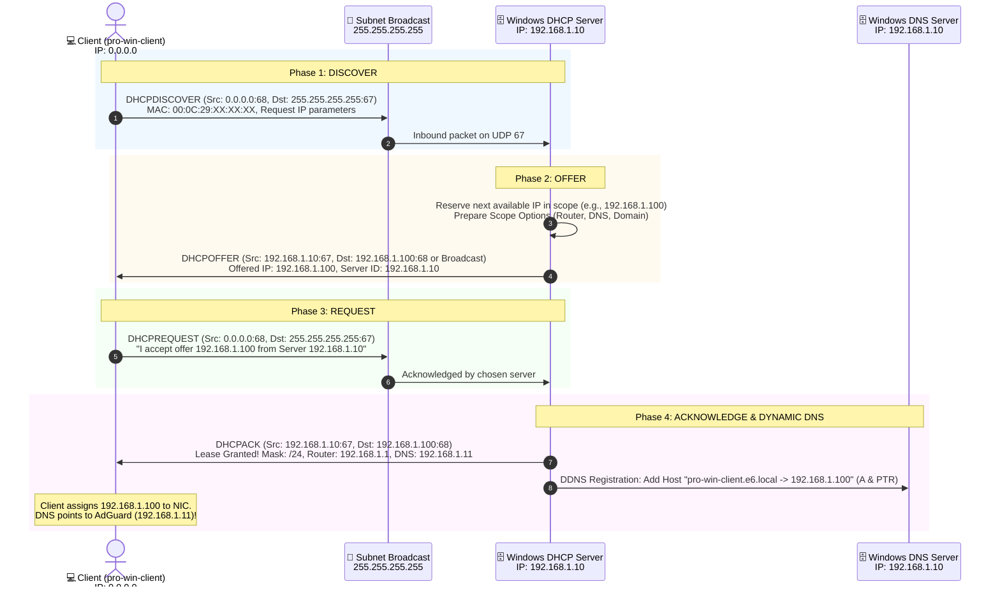

# Enterprise DHCP Server Architecture & Hybrid DNS Integration

**Document Version:** 1.0  
**Target Environment:** Windows Server 2022 Datacenter, Active Directory Domain Services (`e6.local`), VMware Workstation Pro (`VMnet8` NAT)  
**Host Architecture:** Windows 11 Host (Intel Core i9-14900HX), VMware Workstation 17 Pro  
**Author:** Network & Systems Engineering Class (Year 4)

---

## 1. Executive Summary & Design Vision

In enterprise network infrastructure, manual static IP configuration on client devices is unscalable, prone to IP address collisions, and introduces operational overhead. Dynamic Host Configuration Protocol (DHCP, RFC 2131) automates the leasing of Layer-3 network parameters (IP address, subnet mask, default gateway, and DNS servers).

However, in this hybrid enterprise lab, DHCP serves a far more critical role: **it is the central orchestration engine that unites client devices with our Two-Tier Hybrid DNS Architecture (`192.168.1.10` Windows DNS + `192.168.1.11` AdGuard Home Docker)**.

```
┌─────────────────────────────────────────────────────────────────────────────────┐
│                           THE ENTERPRISE LIFECYCLE                              │
│                                                                                 │
│   💻 Client Powers On (0.0.0.0)                                                 │
│       │                                                                         │
│       ▼ (DHCP DORA Process)                                                     │
│   🗄️ Windows Server DHCP (192.168.1.10) leases:                                 │
│       • IP: 192.168.1.105                                                       │
│       • Gateway: 192.168.1.1 (VMware NAT)                                       │
│       • DNS Server: 192.168.1.11 (AdGuard Home Container)                      │
│       • Domain Name: e6.local                                                   │
│       │                                                                         │
│       ├─────────────────────────────────────────┐                               │
│       ▼ (Dynamic DNS - DDNS)                    ▼ (Zero-Touch Client Security)  │
│   Registers "client.e6.local"               Client browses the web:             │
│   automatically into Windows DNS            • Ads/Trackers: Sinkholed (0.0.0.0) │
│   Forward & Reverse Lookup Zones!           • Internal: Resolves *.e6.local     │
│                                             • Public: Encrypted via Cloudflare  │
└─────────────────────────────────────────────────────────────────────────────────┘
```

---

## 2. High-Level Architectural Topology

```
┌────────────────────────────────────────────────────────────────────────────────────────┐
│ HYPERVISOR VIRTUAL SUBNET: VMnet8 NAT (192.168.1.0/24)                                  │
│                                                                                        │
│  ┌──────────────────────────────────────────────────────────────────────────────────┐  │
│  │ WINDOWS SERVER 2022 (WIN-J17IMHCEMA9.e6.local)                                   │  │
│  │                                                                                  │  │
│  │   [Primary IP: 192.168.1.10]                     [Secondary IP: 192.168.1.11]   │  │
│  │   ├─ Active Directory Domain Services (e6.local) └─ AdGuard Home (Docker)        │  │
│  │   ├─ Native Windows DNS Server (Port 53)            ├─ Port 53 DNS Resolver      │  │
│  │   ├─ Native Windows DHCP Server (Port 67)           ├─ Upstream: 1.1.1.1 (DoH)   │  │
│  │   │  ├─ Scope: 192.168.1.100 - 192.168.1.200        └─ Upstream: 192.168.1.10:53 │  │
│  │   │  ├─ Option 003 (Router): 192.168.1.1                                         │  │
│  │   │  ├─ Option 006 (DNS): 192.168.1.11 ───► (Points Clients directly to AdGuard!)│  │
│  │   │  └─ Option 015 (Domain): e6.local                                            │  │
│  │   └─ DDNS Engine (Registers leases into DNS)                                     │  │
│  └──────────────────────────────────────────────────────────────────────────────────┘  │
│                                      ▲                                                 │
│                        DHCP DORA     │ DHCP Leases Distributed                         │
│                        Broadcasts    │ Automatically                                   │
│                                      ▼                                                 │
│  ┌────────────────────────┐  ┌────────────────────────┐  ┌──────────────────────────┐  │
│  │ Client VM 1            │  │ Client VM 2            │  │ Future Lab VMs           │  │
│  │ (pro-win-client)       │  │ (pro-win-client2)      │  │ (Linux / Web / Database) │  │
│  │ Leased: 192.168.1.100  │  │ Leased: 192.168.1.101  │  │ Leased: 192.168.1.102+   │  │
│  │ DNS: 192.168.1.11      │  │ DNS: 192.168.1.11      │  │ DNS: 192.168.1.11        │  │
│  └────────────────────────┘  └────────────────────────┘  └──────────────────────────┘  │
│                                                                                        │
│  VMware Virtual Gateway (vmnat.exe): 192.168.1.1 (WAN Egress to Host Wi-Fi)            │
│  ⚠️ VMware Built-in DHCP (vmnetdhcp.exe): DISABLED (To eliminate Rogue DHCP conflict)   │
└────────────────────────────────────────────────────────────────────────────────────────┘
```

---

## 3. The DORA Lifecycle & Protocol Mechanics

DHCP operates over UDP on standard ports:
* **Server Port:** `UDP 67`
* **Client Port:** `UDP 68`

When an unconfigured client boots up, it undergoes the four-stage **DORA** exchange:



---

## 4. Key Architectural Hazards & Engineering Solutions

### Hazard 1: The VMware Rogue DHCP Collision (Race Condition)
* **The Problem:** By default, VMware Workstation runs its own internal DHCP engine (`vmnetdhcp.exe`) on `VMnet8`. When a client broadcasts a `DHCPDISCOVER`, **both** VMware and Windows Server reply with a `DHCPOFFER`.
* **The Impact:** The client accepts whichever packet arrives first (a non-deterministic race condition). If VMware wins:
  * Client DNS is set to VMware's internal resolver (`192.168.1.2`).
  * **Catastrophic Failure:** The client completely bypasses AdGuard ad-blocking, fails to discover the Active Directory Domain Controller (`e6.local`), and domain logins fail.
* **The Solution:** In VMware's **Virtual Network Editor**, uncheck *"Use local DHCP service to distribute IP address to VMs"* on `VMnet8`. This disables `vmnetdhcp.exe`, making Windows Server the **sole authoritative DHCP server** on the subnet.

---

### Hazard 2: AdGuard Home's Built-in DHCP vs. Windows Server DHCP
* **The Problem:** AdGuard Home contains an integrated lightweight DHCP server intended for home routers.
* **The Comparison:**

| Feature | Windows Server DHCP | AdGuard Home DHCP |
| :--- | :---: | :---: |
| **Active Directory Authorization** | ✅ **Mandatory (RFC / Microsoft Security)** | ❌ None (Rogue to AD) |
| **Dynamic DNS (DDNS) into AD** | ✅ **Native Kerberos authenticated DDNS** | ❌ None |
| **Enterprise Scope Options (003, 006, 015, 066)** | ✅ **Full RFC standard support** | ⚠️ Basic only |
| **Failover & High Availability** | ✅ **DHCP Failover (Active-Active/Standby)** | ❌ None |
| **Audit Logs & MMC Management** | ✅ **Event Viewer & DHCP MMC** | ⚠️ Web UI only |

* **The Architectural Rule:** **AdGuard DHCP MUST remain permanently DISABLED.** Windows Server DHCP acts as the central brain.

---

### Hazard 3: Active Directory DHCP Authorization Security Guard
* **The Problem:** In an Active Directory forest, an unauthorized (rogue) DHCP server can poison network routing by issuing malicious gateways and DNS servers.
* **Microsoft AD Security Guard:** A Windows DHCP Server joined to Active Directory checks the AD database (`CN=NetServices,CN=Configuration,DC=e6,DC=local`) upon startup. If it is **not authorized** by an Enterprise Administrator, the DHCP service **shuts itself down automatically** and refuses to issue IP leases.
* **The Solution:** After installing the DHCP role, execute the authorization handshake via GUI or PowerShell:
  ```powershell
  Add-DhcpServerInDC -DnsName WIN-J17IMHCEMA9.e6.local -IPAddress 192.168.1.10
  ```

---

## 5. Master Subnet & IP Pool Allocation Schema

To prevent static IP collisions, the `192.168.1.0/24` subnet is strictly partitioned into functional zones:

```text
192.168.1.0 ────┬────────────────────────────────────────────────────────┐
                │ 192.168.1.1        : VMware Virtual NAT Gateway (vmnat.exe)
                │ 192.168.1.2        : VMware Host Virtual Adapter (VMnet8)
 STATIC POOL    │ 192.168.1.10       : Windows Server 2022 (AD DC, DNS, DHCP)
 (Reserved for  │ 192.168.1.11       : AdGuard Home Docker Container
 Infrastructure)│ 192.168.1.12 - .49 : Future Domain Controllers / Hypervisors
                │ 192.168.1.50 - .99 : Static Servers (File Server, Web, DB)
                ├────────────────────────────────────────────────────────┤
 DYNAMIC LEASE  │ 192.168.1.100      : Dynamic Client Start
 POOL           │       ...          : Dynamic Range (101 addresses)
 (DHCP Scope)   │ 192.168.1.200      : Dynamic Client End
                ├────────────────────────────────────────────────────────┤
 RESERVED POOL  │ 192.168.1.201      : Future Expansion / Lab Devices
 (Unused)       │ 192.168.1.254      : Network Broadcast: 192.168.1.255
192.168.1.255 ──┴────────────────────────────────────────────────────────┘
```

---

## 6. DHCP Scope Options Strategy (The Integration Glue)

When Windows DHCP grants an IP address to a client, it transmits critical **Scope Options**:

| Option Code | Option Name | Value Assigned | Architectural Purpose |
| :---: | :--- | :--- | :--- |
| **`003`** | **Router (Default Gateway)** | `192.168.1.1` | Directs all non-local internet packets to VMware's virtual NAT gateway. |
| **`006`** | **DNS Servers** | **`192.168.1.11`** | **The Key Anchor:** Forces every client to query AdGuard Home! Gives clients instant ad-blocking, Cloudflare DoH, and conditional forwarding to AD. |
| **`015`** | **Domain Name** | `e6.local` | Injects the primary DNS search suffix into client network adapters. Enables short name resolution (`ping fileserver` ➔ `fileserver.e6.local`). |

---

## 7. Dynamic DNS (DDNS) Integration Mechanics

When a client receives a dynamic IP address (e.g. `192.168.1.105`), how do other machines connect to it by name?

In this architecture, Windows DHCP is configured with **Dynamic DNS Updates**:
1. When Windows DHCP grants a lease to `pro-win-client` at `192.168.1.100`, DHCP communicates directly with Windows DNS (`dns.exe` on `.10`).
2. DHCP creates:
   * **Forward Lookup `A` Record:** `pro-win-client.e6.local` ➔ `192.168.1.100`
   * **Reverse Lookup `PTR` Record:** `100.1.168.192.in-addr.arpa` ➔ `pro-win-client.e6.local`
3. When the lease expires or is released, DHCP automatically deletes the records, keeping the Active Directory DNS database pristine.

---

## 8. Summary of Architectural Advantages

1. **Zero-Touch Client Onboarding:**  
   New virtual machines or workstations set to DHCP automatically inherit the full security stack: gateway, domain suffix, and encrypted ad-blocking DNS.
2. **Unified Control Plane:**  
   Centralized IP allocation and reservation management directly from Windows Server Manager and PowerShell.
3. **Seamless Hybrid Coexistence:**  
   Clients query `192.168.1.11` (AdGuard) for DNS, while `192.168.1.10` (Windows Server) coordinates all DHCP leases and Active Directory identity.
