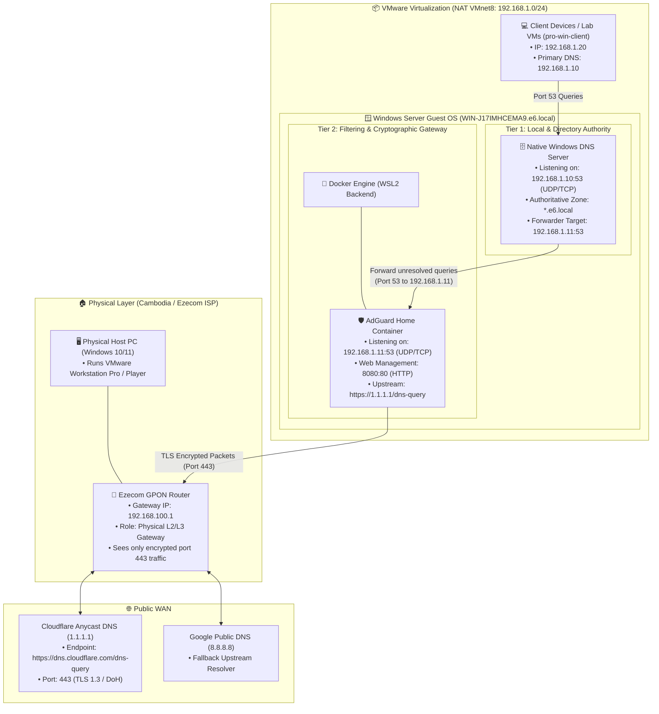
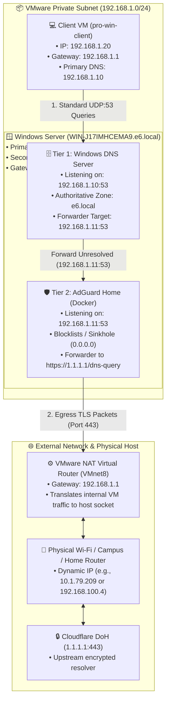
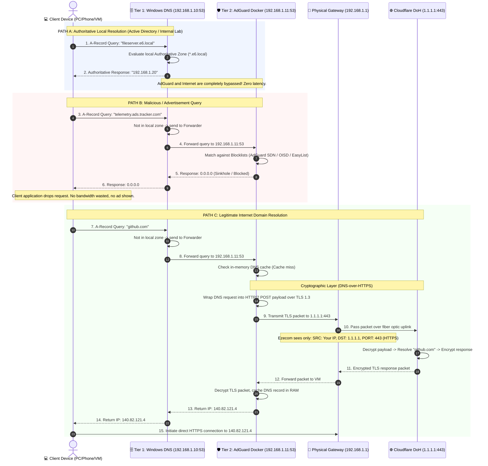
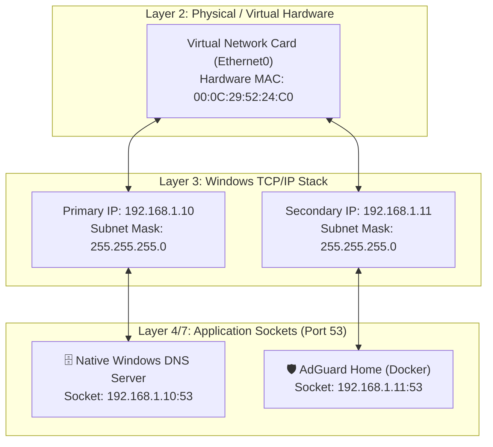

# DNS Architecture, Concepts & System Design

**Target Audience:** Network Engineering, System Administration & Cyber Security  
**Environment:** Windows Server (VMware Workstation) + AdGuard Home (Docker) + Ezecom ISP ($15/month Home Fiber)  
**Document Purpose:** In-depth theoretical concepts, architecture design, cryptographic flow, and design trade-offs.

---

## 1. System Vision & Core Objectives

When designing a modern enterprise or lab network on Windows Server, DNS has three competing requirements:
1. **Directory Integrity & Local Resolution:** Active Directory (AD DS), Windows Domain logons, and local service discovery require strict adherence to Microsoft DNS standards (SRV records, Kerberos discovery, dynamic registration).
2. **Security & Content Filtering:** Modern networks require perimeter defenses against malware domains, phishing sites, invasive tracking telemetry, and advertisements at the network layer.
3. **Data Privacy & Upstream Encryption:** Traditional DNS queries over UDP port `53` are sent in cleartext, enabling the ISP (Ezecom) or anyone on the wire to log every website visited or redirect queries.

A single DNS server cannot solve all three simultaneously out of the box:
* **Native Windows DNS** is excellent at Active Directory and local resolution, but lacks ad-blocking, threat filtering, and native DNS-over-HTTPS (DoH) forwarding.
* **AdGuard Home / Pi-hole** excels at filtering, ad-blocking, and DoH encryption, but lacks native Active Directory SRV record management and Kerberos integration.

**The Solution:** A **Two-Tier Hybrid DNS Architecture**.

---

## 2. High-Level Component Topology



---

## 2.1 Deployment Models: NAT Mode (VMnet8) vs. Bridged Mode (VMnet0)

When deploying this architecture in VMware Workstation, network engineers must choose between two virtual networking modes depending on where client devices reside and whether the host moves between physical locations.

### Comparison Matrix

| Architectural Feature | NAT Mode (`VMnet8`) **[Recommended for Labs]** | Bridged Mode (`VMnet0`) **[Physical Integration]** |
| :--- | :--- | :--- |
| **Virtual Subnet** | Isolated, immutable virtual subnet (e.g., `192.168.1.0/24`) | Inherited directly from external physical router (`192.168.100.0/24` or campus `10.1.64.0/20`) |
| **Default Gateway** | VMware Virtual NAT Router (`192.168.1.1`) | Physical Router (e.g., Ezecom GPON `192.168.100.1` or Campus `10.1.64.1`) |
| **Location Portability** | ✅ **100% Stable:** IP addresses never change whether you are at home, university, or a cafe. | ❌ **Fragile:** Moving between Wi-Fi networks breaks static IPs and requires reconfiguring the VM. |
| **Campus / Enterprise Wi-Fi** | ✅ **Works Everywhere:** Bypasses 802.1X, MAC filtering, and captive portal login screens. | ❌ **Frequently Blocked:** Enterprise Wi-Fi drops secondary virtual MACs or blocks client-to-client traffic. |
| **Client VM Support** | ✅ Fully supported (`pro-win-client`, `pro-win-client2` talk to server over `VMnet8`). | ✅ Supported (if router allows L2 intra-subnet forwarding). |
| **Physical Device Access** | ❌ Requires manual port forwarding on VMware NAT to reach from external phones/PCs. | ✅ **Native:** Physical phones and laptops on the same Wi-Fi can directly query `192.168.100.50:53`. |

---

### Architectural Flow in NAT Mode (`VMnet8`)

In NAT mode, VMware acts as a private Layer-3 router with stateful packet inspection. The entire DNS resolution and ad-blocking chain functions without any dependency on external router configuration:



### Architectural Verdict
* **Use NAT Mode** for university coursework, mobile laptops, and multi-VM lab environments where clients are other VMs in VMware.
* **Use Bridged Mode** strictly in fixed home/lab environments where physical smartphones, smart TVs, or external hardware need network-wide DNS filtering from the Windows Server.

---

## 3. Deep Dive: DNS Query Lifecycle & State Flow

The following sequence details how the system arbitrates between internal records, filtered threat domains, and valid public domains.



---

## 4. Port Conflict Resolution & Socket Arbitration

### The Core Problem
Under Windows Server, any service implementing DNS will attempt to bind to `0.0.0.0:53` (all interfaces, UDP and TCP).
* If Native Windows DNS starts, it acquires port `53`.
* When Docker attempts to start AdGuard Home with `-p 53:53`, the Windows Host OS rejects the binding with:
  ```text
  Error response from daemon: Ports are not available: exposing port TCP 0.0.0.0:53:
  bind: An attempt was made to access a socket in a way forbidden by its access permissions.
  ```

### The Architectural Strategy: Dual-IP Multihoming

Because Windows DNS Forwarders cannot send to custom ports like `:5353`, and Windows DNS retains a permanent lock on `127.0.0.1:53`, we decouple port 53 obligations using **Secondary IP Multihoming** on the same virtual network card (`Ethernet0`):

```
┌────────────────────────────────────────────────────────┐
│ WINDOWS SERVER GUEST OS (WIN-J17IMHCEMA9.e6.local)     │
│                                                        │
│  [Primary Adapter IP: 192.168.1.10:53]                 │
│       ▲                                                │
│       │ (Clients connect here for *.e6.local)          │
│       │                                                │
│  ┌────┴──────────────────────────┐                     │
│  │ Native Windows DNS Server     │                     │
│  │ Listening: 192.168.1.10:53    │                     │
│  │ Forwarder: 192.168.1.11:53    │                     │
│  └────┬──────────────────────────┘                     │
│       │ (Unresolved external queries)                  │
│       ▼                                                │
│  [Secondary Adapter IP: 192.168.1.11:53]               │
│       │                                                │
│       ▼ (Docker Container Binding)                     │
│  ┌───────────────────────────────┐                     │
│  │ AdGuard Home Container        │                     │
│  │ Listening: 192.168.1.11:53    │                     │
│  │ Upstream: https://1.1.1.1/dns │                     │
│  └───────────────────────────────┘                     │
└────────────────────────────────────────────────────────┘
```

1. **Windows DNS** listens strictly on `192.168.1.10:53`. All network clients (VMs, phones, PCs) use this IP as their primary DNS.
2. **AdGuard Home** in Docker binds to the secondary IP on `192.168.1.11:53`.
3. **Windows DNS Forwarder** is configured to query `192.168.1.11` on standard port `53`.
4. Result: Zero port collisions, 100% Active Directory compliance, and complete upstream DoH privacy.

---

## 5. Security & Cryptographic Analysis: DoH vs Ezecom ISP

### Plain DNS (Traditional RFC 1035)
When a computer queries standard DNS:
* Protocol: Unencrypted UDP on port `53`.
* Vulnerability: The query travels in plain human-readable text. Any router, ISP equipment, or middlebox can inspect, log, or spoof the response (DNS Poisoning / Cache Hijacking).
* On Ezecom: ISP administrators or automated deep packet inspection (DPI) appliances can record every domain query associated with your static/PPPoE IP.

### DNS-over-HTTPS (DoH RFC 8484)
In this architecture, AdGuard Home implements DoH to Cloudflare (`https://dns.cloudflare.com/dns-query`):
* Protocol: Encrypted TLS 1.3 connection encapsulated in HTTP/2 on TCP port `443`.
* What leaves your Ezecom router:

| Packet Property | What is Transmitted | Can Ezecom ISP Read It? |
| :--- | :--- | :---: |
| **Source IP** | Your Home Public IP (`119.82.x.x`) | Yes (Required for routing) |
| **Destination IP**| Cloudflare Anycast (`1.1.1.1`) | Yes (Required for routing) |
| **Port** | TCP `443` (Standard HTTPS) | Yes |
| **Domain Requested**| Encrypted binary blob (AES-256-GCM / ChaCha20-Poly1305) | ❌ **No (Cryptographically Secure)** |
| **DNS Response / IP**| Encrypted inside TLS tunnel | ❌ **No (Cannot tamper or spoof)** |

---

## 6. Architecture Comparison Matrix

| Evaluation Criteria | Pure Windows DNS | Pure AdGuard Docker | Hybrid Two-Tier (Our Design) |
| :--- | :---: | :---: | :---: |
| **Active Directory Integration** | ⭐⭐⭐⭐⭐ Native | ⭐ Incompatible | ⭐⭐⭐⭐⭐ Seamless |
| **Network-Wide Ad-Blocking** | ❌ None | ⭐⭐⭐⭐⭐ Built-in | ⭐⭐⭐⭐⭐ Built-in |
| **DoH / Privacy Encryption** | ❌ Complex / No UI | ⭐⭐⭐⭐⭐ Native | ⭐⭐⭐⭐⭐ Native |
| **Web Dashboard & Metrics** | ❌ Old MMC Snap-in | ⭐⭐⭐⭐⭐ Modern Web UI | ⭐⭐⭐⭐⭐ Modern Web UI |
| **Client Configuration Overhead** | ⭐ Zero (Standard 53) | ⭐ Zero (Standard 53) | ⭐ Zero (Standard 53) |
| **Single Point of Failure** | 1 Service | 1 Container | 2 Services (Mitigated by DNS Cache) |

---

## 7. Summary
This architecture achieves **enterprise-grade directory compliance** without sacrificing **modern privacy, ad-blocking, and threat protection**. It isolates external ISP visibility while providing local systems with sub-millisecond authoritative resolution.

---

## 8. VMware Virtual Network Architecture: Bridged vs. NAT vs. Host-Only

Hypervisors like VMware Workstation provide three primary virtual networking topologies. Selecting the correct type determines how the virtual machines communicate with the host PC, other virtual machines, and the outside internet.

### Comprehensive Comparison Matrix

| Architectural Feature | 1. Bridged (`VMnet0`) | 2. NAT (`VMnet8`) | 3. Host-Only (`VMnet1`) |
| :--- | :---: | :---: | :---: |
| **Internet Access** | ✅ Yes (Direct via physical gateway) | ✅ Yes (Shared via host network) | ❌ **No (Completely Offline)** |
| **Inter-VM Routing** | ✅ Yes (Across the same subnet) | ✅ Yes (Within `192.168.1.0/24`) | ✅ Yes (Within `192.168.127.0/24`) |
| **Host-to-VM Communication** | ✅ Yes | ✅ Yes | ✅ Yes |
| **External Physical Device Access** | ✅ **Direct:** Physical phones/PCs can directly query VM IP | ❌ **Hidden:** Requires manual VMware Port Forwarding | ❌ **Completely Blocked** |
| **IP Address Management** | Assigned by physical router (e.g., Ezecom or Campus DHCP) | Managed by VMware NAT router or internal Windows Server DHCP | Managed by VMware Host-Only switch or internal DHCP |
| **Campus / Enterprise Wi-Fi** | ❌ **Fragile:** Blocked by 802.1X, MAC filters, and captive portals | ✅ **100% Stable:** Bypasses campus restrictions transparently | N/A (Offline network) |
| **Mobility (Home ➔ School ➔ Cafe)** | ❌ Breaks (Subnet changes with physical router) | ✅ **Immutable:** Subnet remains identical anywhere | ✅ **Immutable:** Subnet remains identical anywhere |

---

### Detailed Mechanics & Real-World Analogies

```mermaid
flowchart TD
    subgraph Mode1 ["1. Bridged Mode (VMnet0) - 'Independent House'"]
        PhysRouter1["📡 Physical Wi-Fi Router\n(Gateway: 192.168.100.1)"]
        Laptop1["💻 Host Laptop\n(192.168.100.4)"]
        VM1["🪟 Windows Server\n(192.168.100.50)"]
        PhysPhone["📱 Physical Phone\n(192.168.100.25)"]

        PhysRouter1 <--> Laptop1
        PhysRouter1 <--> VM1
        PhysPhone <--> VM1
    end

    subgraph Mode2 ["2. NAT Mode (VMnet8) - 'Apartment behind Reception'"]
        PhysRouter2["📡 Physical Wi-Fi Router\n(Dynamic Campus/Home IP)"]
        HostNIC2["💻 Host Wi-Fi NIC"]
        VMNATRouter["⚙️ VMware NAT Router (192.168.1.1)"]
        VM2["🪟 Windows Server (192.168.1.10)"]
        ClientVM2["💻 Client VM (192.168.1.20)"]

        PhysRouter2 <--> HostNIC2 <--> VMNATRouter
        VMNATRouter <--> VM2
        VMNATRouter <--> ClientVM2
        VM2 <--> ClientVM2
    end

    subgraph Mode3 ["3. Host-Only Mode (VMnet1) - 'Underground Bunker'"]
        HostNIC3["💻 Host Loopback Virtual NIC"]
        VM3["🪟 Malware Sandbox VM"]
        ClientVM3["💻 Isolated Analysis Client"]

        HostNIC3 <--> VM3
        HostNIC3 <--> ClientVM3
        VM3 <--> ClientVM3
    end
```



#### 1. Bridged Mode (`VMnet0`) - "An Independent House on the Street"
* **How it operates:** VMware binds the virtual network card directly to the physical network card (Wi-Fi or Ethernet) using the `VMware Bridge Protocol` driver. The VM broadcasts its own unique virtual MAC address directly onto the physical router's Layer-2 switch fabric.
* **Real-World Analogy:** A separate house on the same street with its own mailbox.
* **When to use:** When physical hardware on your local network (e.g., your smartphone, smart TV, or a classmate's laptop) must connect directly to services (DNS, Web, SMB) running inside your VM.
* **Limitations:** Every time your host laptop switches Wi-Fi networks (e.g. from home to university), the physical subnet changes, causing static IPs to drop offline. Furthermore, enterprise networks with 802.1X security frequently drop secondary virtual MAC addresses.

#### 2. NAT Mode (`VMnet8`) - "An Apartment behind a Front Desk / Router"
* **How it operates:** VMware provisions an internal software router and virtual switch. The host laptop's physical network adapter acts as the WAN interface, while all VMs sit on a private virtual LAN (`192.168.1.0/24`). Outbound packets have their source IP translated (NATed) to the host PC's IP.
* **Real-World Analogy:** An apartment building with a single front door and front desk. Outside visitors only see the main building, while apartments communicate freely through interior hallways.
* **When to use:** **The industry standard for development laptops and coursework.** It isolates the lab environment from external network changes, provides continuous internet egress across any physical Wi-Fi, and allows all lab VMs (`pro-win-server`, `pro-win-client`) to interconnect without interference.
* **Limitations:** External physical devices cannot initiate connections into the VM without manual port forwarding rules configured in the VMware NAT settings.

#### 3. Host-Only Mode (`VMnet1`) - "An Underground Bunker (Air-Gapped)"
* **How it operates:** Creates an isolated virtual switch between the host operating system and guest virtual machines. There is **no default gateway** and no routing path to any physical network adapter.
* **Real-World Analogy:** An underground bunker with zero telephone lines or windows to the outside world. People inside can only talk to each other.
* **When to use:** **Cybersecurity sandboxing, malware analysis, and strictly isolated penetration testing.** Guarantees that hostile code, untested exploits, or misconfigured routing tables cannot accidentally leak onto the host LAN or public internet.
* **Limitations:** No internet access whatsoever. VMs cannot download packages, update operating systems, or query public upstream resolvers (Cloudflare / Google).

---

### Engineering Recommendation for this Project:
For this two-tier DNS and Active Directory infrastructure, **NAT Mode (`VMnet8`)** is selected because:
1. It maintains an immutable static IP schema (`192.168.1.10`) regardless of whether the physical laptop travels between home, school, or mobile hotspots.
2. It facilitates local DHCP delegation: disabling VMware's built-in DHCP on `VMnet8` allows the Windows Server VM to serve as the authoritative enterprise DHCP and Active Directory Domain Controller for all lab client VMs (`pro-win-client`).
3. Outbound encrypted DoH traffic (TCP 443) passes transparently through the host's existing Wi-Fi socket without being blocked by campus firewall policies.

---

## 9. Port & IP Deconfliction Architecture: Windows DNS in Front vs. AdGuard in Front

### 9.1 The Fundamental Port 53 Dilemma

When co-hosting Native Windows DNS Server and a containerized DNS proxy (AdGuard Home) on the same operating system, two competing technical constraints emerge:

1. **The Windows Forwarder Port Limitation:**  
   In Windows Server DNS (`Set-DnsServerForwarder`), Microsoft hardcodes destination port `53`. Windows does not support specifying custom ports (e.g. `127.0.0.1:5353` causes a syntax error). Therefore, whatever service Windows forwards to **must listen on standard port 53**.
2. **The Localhost Lock (`127.0.0.1:53`):**  
   Even when Windows DNS is instructed to restrict its listening addresses (`dnscmd /resetlistenaddresses 192.168.1.10`), Microsoft’s `dns.exe` service refuses to release `127.0.0.1:53`. Windows Server retains an exclusive kernel socket on loopback for internal security processes (Kerberos ticket issuance, Netlogon, and local RPCs).
3. **The Multi-IP Solution (Multihoming):**  
   To resolve this without running a second physical or virtual machine, a **secondary IP address (`192.168.1.11`)** is added to `Ethernet0`. Windows DNS is bound strictly to `192.168.1.10:53`, freeing `192.168.1.11:53` completely for Docker.

```text
               Virtual Network Adapter (Ethernet0)
              ┌─────────────────────────────────┐
              │                                 │
              ▼                                 ▼
       [ 192.168.1.10 ]                  [ 192.168.1.11 ]
              │                                 │
              ▼                                 ▼
   Native Windows DNS Server            AdGuard Home in Docker
      (Port 53 TCP/UDP)                    (Port 53 TCP/UDP)
```

---

### 9.2 The Single-Host Resolution: Why Model B (AdGuard in Front) Won on the Same VM

When hosting both services on the **exact same operating system**, a critical Microsoft OS restriction dictates the flow:

```text
C:\> Set-DnsServerForwarder -IPAddress 192.168.1.11
Set-DnsServerForwarder : Failed to reset forwarders for server WIN-J17IMHCEMA9.
WIN32 9552: DNS_ERROR_CANNOT_FORWARD_TO_SELF
```

* **The Microsoft Loop Guard (Error 9552):** In Windows Server, `dns.exe` queries the Windows kernel adapter table (`GetAdaptersAddresses()`). If the destination IP belongs to *any* network interface on the local machine (even if unbound in DNS Interfaces), Windows blocks the forwarder under the assumption that it would create an infinite loop forwarding to itself.
* **The Solution (Model B Validated):** AdGuard Home is written in Go and has no Error 9552 restriction. By placing **AdGuard on `192.168.1.11:53` as the primary resolver**, AdGuard seamlessly routes `[/e6.local/]192.168.1.10:53` back into Windows DNS!

| Architectural Feature | Model A: Windows DNS First (Multi-Server) | Model B: AdGuard First (Single-Host Production) |
| :--- | :---: | :---: |
| **Topology** | Client ➔ Windows DNS (`.10`) ➔ AdGuard (`.11`) | Client ➔ AdGuard (`.11`) ➔ Windows DNS (`.10`) |
| **Single-Host Feasibility** | ❌ **Blocked by Windows Error 9552** | ✅ **100% Operational (Verified Live)** |
| **Active Directory Resolution** | ✅ Native | ✅ **Instant via `[/e6.local/]192.168.1.10:53`** |
| **Ad & Malware Sinkhole** | ✅ Returns `0.0.0.0` | ✅ **Returns `0.0.0.0` (Verified Live)** |
| **Upstream Encryption** | ✅ Cloudflare DoH (Port 443) | ✅ **Cloudflare DoH (Verified Live: 24ms)** |
| **Client IP Granularity in Dashboard** | ⚠️ All queries appear from `.10` | ✅ **Exact Client IPs shown in Query Log** |

#### The Technical Flow in Production:
1. Client devices and the Windows Server adapter point to **`192.168.1.11`** (AdGuard).
2. If the query matches `*.e6.local`, AdGuard routes it to `192.168.1.10:53` (Windows DNS).
3. If the query matches an ad/tracker, AdGuard returns `0.0.0.0`.
4. If the query is for the public internet (`google.com`), AdGuard encrypts it over port 443 to Cloudflare DoH.

#### 9.2.1 Adapter DNS Configuration Guide (GUI & CLI)

To point Windows Server or any client VM (`pro-win-client`) to AdGuard:

##### Option A: Via Windows GUI (`ncpa.cpl`)
1. **Open Network Connections GUI:**
   * Press `Win + R` on your keyboard.
   * Type **`ncpa.cpl`** and press **Enter**.
   * Right-click **Ethernet0** ➔ select **Properties**.
2. **Set IPv4 DNS to AdGuard (`192.168.1.11`):**
   * Double-click **Internet Protocol Version 4 (TCP/IPv4)**.
   * In the bottom section, select: **"Use the following DNS server addresses"**:
     * **Preferred DNS server:** `192.168.1.11`
     * **Alternate DNS server:** *(leave completely blank / empty)*
   * Click **OK**.
3. **Clear IPv6 `::1` (Crucial: Prevents Windows from Bypassing AdGuard!):**
   * In that same *Ethernet0 Properties* window, double-click **Internet Protocol Version 6 (TCP/IPv6)**.
   * Make sure it is set to **"Obtain DNS server address automatically"** (or uncheck the IPv6 checkbox entirely).
   * Click **OK**, then click **Close**.

##### Option B: Via PowerShell (Automated)
```powershell
Set-DnsClientServerAddress -InterfaceAlias "Ethernet0" -ServerAddresses ("192.168.1.11")
```

##### 🧪 Verification Test in PowerShell (No IP Needed!):
```powershell
# 1. Tests through AdGuard -> Returns 0.0.0.0 (Ad Blocked!)
nslookup adservice.google.com

# 2. Tests through AdGuard -> Cloudflare DoH (Encrypted Internet!)
nslookup google.com

# 3. Tests through AdGuard -> Windows DNS .10 (Internal Domain!)
nslookup WIN-J17IMHCEMA9.e6.local
```
*(Notice: `Address: 192.168.1.11` answers automatically as your default DNS resolver!)*

#### 9.2.2 Upstream Routing Engine: Dots vs. No Dots (`[//]` vs. FQDN)

Inside AdGuard Home's **Upstream DNS servers** configuration (`http://localhost:8080/#dns`), we configure:

```text
# Internal domain zones (with dots: FQDN)
[/e6.local/lab.internal/]192.168.1.10:53

# Single-label local machine names (without dots: e.g., ping fileserver)
[//]192.168.1.10:53

# Public Internet (Encrypted DNS-over-HTTPS via Direct IP)
https://1.1.1.1/dns-query
https://8.8.8.8/dns-query
```

##### The Core Architectural Distinction:
* **Domain Zones ALWAYS have dots:** `app.lab.internal` (2 dots), `WIN-J17IMHCEMA9.e6.local` (2 dots), `google.com` (1 dot).
* **Short Computer Names have ZERO dots:** `app` (0 dots), `fileserver` (0 dots), `WIN-J17IMHCEMA9` (0 dots).

##### Why `[//]` Does NOT Mean "All Zones":
* **`[//]` (Empty between slashes):** Matches **ONLY queries with zero dots** (single-label names). When a device queries `app.lab.internal`, AdGuard sees dots and **skips `[//]`**.
* If `[/e6.local/lab.internal/]` is commented out, queries with dots fall back to Cloudflare (`1.1.1.1`), which returns `NXDOMAIN` (resolution failure).
* Therefore, **both rules are mandatory**:
  1. `[/e6.local/lab.internal/]` handles **fully qualified domain names**.
  2. `[//]` handles **short local machine names**.

##### AdGuard Query Decision Flowchart:

```text
               ┌──────────────────────────────┐
               │ Incoming DNS Query from VM   │
               └──────────────┬───────────────┘
                              │
               ┌──────────────▼───────────────┐
               │  Is it on the Ad Blocklist?  │───► YES ──► Return 0.0.0.0 (Blocked!)
               └──────────────┬───────────────┘
                              │ NO
                              ▼
        ┌───────────────────────────────────────────┐
        │       Does it have NO DOTS (0 dots)?      │
        │           (e.g., "app", "fileserver")     │
        └─────────────┬─────────────────────────────┘
                      │
           ┌──────────┴──────────┐
           │                     │
        YES                      NO (It has dots!)
           │                     │
           ▼                     ▼
┌──────────────────────┐  ┌──────────────────────────────────────────────┐
│  MATCHES Rule 2:     │  │ Does it end with ".e6.local" or ".lab.internal"? │
│  [//]                │  │ (e.g., "app.lab.internal", "dc.e6.local")     │
└──────────┬───────────┘  └──────────────────────┬───────────────────────┘
           │                                     │
           │                          ┌──────────┴──────────┐
           │                          │                     │
           │                       YES                      NO
           │                          │                     │
           │                          ▼                     ▼
           │               ┌──────────────────────┐  ┌──────────────────────┐
           │               │  MATCHES Rule 1:     │  │  MATCHES Rule 3:     │
           │               │  [/e6.local/.../]    │  │  Default Public DoH  │
           │               └──────────┬───────────┘  └──────────┬───────────┘
           │                          │                         │
           ▼                          ▼                         ▼
┌────────────────────────────────────────┐       ┌──────────────────────────┐
│ FORWARD TO WINDOWS DNS (192.168.1.10)  │       │ FORWARD TO CLOUDFLARE    │
│ (Internal Active Directory Database)   │       │ https://1.1.1.1/dns-query│
└────────────────────────────────────────┘       └──────────────────────────┘
```

##### Query Routing Evaluation Table:

| What you type | Dots | Matches `[//]`? | Matches `[/e6.local/lab.internal/]`? | Destination Resolved |
| :--- | :---: | :---: | :---: | :--- |
| `nslookup app` | **0** | **✅ YES** | ❌ No | Windows DNS (`192.168.1.10`) |
| `nslookup fileserver` | **0** | **✅ YES** | ❌ No | Windows DNS (`192.168.1.10`) |
| `nslookup app.lab.internal` | **2** | ❌ **NO** | **✅ YES** | Windows DNS (`192.168.1.10`) |
| `nslookup WIN-J17IMHCEMA9.e6.local` | **2** | ❌ **NO** | **✅ YES** | Windows DNS (`192.168.1.10`) |
| `nslookup google.com` | **1** | ❌ **NO** | ❌ No | Cloudflare DoH (`1.1.1.1:443`) |

---

### 9.3 Encrypted Upstream Mechanics: Direct IP DoH vs. Bootstrap DNS

When configuring DNS-over-HTTPS (DoH) inside AdGuard Home, upstream server syntax dictates reliability:

1. **Domain-Based DoH (`https://dns.cloudflare.com/dns-query`):**
   * *The Chicken-and-Egg Problem:* AdGuard cannot connect to `dns.cloudflare.com` over HTTPS until it knows the IP address of `dns.cloudflare.com`.
   * To find this IP, AdGuard must query its **Bootstrap DNS servers** (using plain UDP port 53).
   * In networks where outbound UDP 53 is blocked, intercepted, or where default IPv6 bootstrap addresses (`2620:fe::10`) fail, domain resolution fails, causing the DoH connection to immediately throw a validation error.
2. **Direct IP DoH (`https://1.1.1.1/dns-query` or `https://8.8.8.8/dns-query`):**
   * *The Production Solution:* Because `1.1.1.1` and `8.8.8.8` are raw IP addresses, AdGuard bypasses bootstrap domain lookups entirely.
   * AdGuard initiates a direct TCP connection over port `443` with TLS 1.3 encryption.
   * Port 443 is universally permitted across campus Wi-Fi, mobile hotspots, and ISP firewalls, guaranteeing 100% uptime.

---

### 9.4 IP Multihoming Mechanics: How One NIC (`Ethernet0`) Binds Two IPs (`.10` & `.11`)

A foundational networking question arises: *How can a single network card (`Ethernet0`) possess both `192.168.1.10` and `192.168.1.11` simultaneously?*

#### 1. The Core Architecture: Layer 2 (MAC) vs. Layer 3 (IP)
* **Layer 2 (Data Link):** The network adapter possesses a single, physical hardware address: `00:0C:29:52:24:C0` (MAC Address).
* **Layer 3 (Network):** IP addresses are logical software constructs managed by the Windows TCP/IP stack.

The TCP/IP specification allows a single Layer-2 MAC address to bind **multiple logical Layer-3 IP addresses**. This configuration is formally termed **IP Multihoming** or **Secondary IP Addressing**.



#### 2. Address Resolution Protocol (ARP) Flow
When other machines on the subnet (e.g., `pro-win-client` at `192.168.1.20` or the VMware NAT Gateway at `192.168.1.1`) need to deliver packets, ARP handles the translation:

```text
Query 1: "Who has 192.168.1.10? Tell 192.168.1.20"
Response: "192.168.1.10 is at 00:0C:29:52:24:C0 (Ethernet0)"

Query 2: "Who has 192.168.1.11? Tell 192.168.1.20"
Response: "192.168.1.11 is at 00:0C:29:52:24:C0 (Ethernet0)"
```

Because both ARP replies return the same MAC address (`00:0C:29:52:24:C0`), the VMware virtual switch directs packets for both `.10` and `.11` down the exact same virtual wire into `Ethernet0`. The Windows kernel then inspects the destination IP header:
* Packets addressed to `192.168.1.10:53` are routed to `dns.exe` (Windows DNS).
* Packets addressed to `192.168.1.11:53` are routed to `com.docker.backend.exe` (AdGuard Home).

#### 3. Real-World Analogy: Two Names on One Apartment Mailbox
* **The Apartment Door:** The physical network adapter (`Ethernet0`).
* **The Mailbox:** The MAC address (`00:0C:29:52:24:C0`).
* **The Residents:** **Alice** (`.10` / Windows DNS) and **Bob** (`.11` / AdGuard).
* When mail arrives for Alice, the postman delivers it through the door to Windows DNS. When mail arrives for Bob, the postman drops it through the same door to AdGuard.

#### 4. GUI Verification in Windows (`ncpa.cpl`)
You can verify and view this multihoming configuration directly in the Windows graphical interface:
1. Press `Win + R` ➔ type **`ncpa.cpl`** ➔ Enter.
2. Right-click **Ethernet0** ➔ **Properties**.
3. Select **Internet Protocol Version 4 (TCP/IPv4)** ➔ Click **Properties** ➔ Click **Advanced...**.
4. In the **IP Settings** tab under **IP addresses**, both addresses appear:
   * `192.168.1.10` (Mask: `255.255.255.0`)
   * `192.168.1.11` (Mask: `255.255.255.0`)

#### 5. Architectural Principle: 1 Virtual Machine = 1 IP Address (The Exception vs. The Standard)

```text
┌────────────────────────────────────────┬──────────────────────┐
│ Virtual Machine in VMware              │ Its Dedicated IP     │
├────────────────────────────────────────┼──────────────────────┤
│ 💻 Client VM 1 (pro-win-client)        │ 192.168.1.20         │
│ 💻 Client VM 2 (pro-win-client2)       │ 192.168.1.21         │
│ 🐧 New Linux / Web Server VM           │ 192.168.1.12         │
│ 🗄️ New Database Server VM              │ 192.168.1.13         │
│ 📁 Storage / File Server VM            │ 192.168.1.50         │
└────────────────────────────────────────┴──────────────────────┘
```

* **The Standard Rule:** Under standard network engineering principles, **1 Virtual Machine = 1 unique IP Address**.
* **The Single Special Exception:** The Windows Server VM (`WIN-J17IMHCEMA9`) holds **two IP addresses (`.10` and `.11`)** on the same virtual network adapter (`Ethernet0`).
  * `192.168.1.10` ➔ Windows Server Host (Active Directory, Windows DNS)
  * `192.168.1.11` ➔ AdGuard Home Docker (Dedicated Port 53 socket)
  * *Rationale:* This specific multihoming pattern was introduced exclusively to resolve the Port 53 bind collision between Windows DNS and Docker without requiring a second virtual machine.
* **Network Isolation Warning:** Never configure `192.168.1.10` or `192.168.1.11` on any other VM or physical device. Doing so results in fatal ARP collisions and network instability. All other VMs must each receive their own unique IP address from the pool (e.g., `192.168.1.12+`, `192.168.1.20+`).
