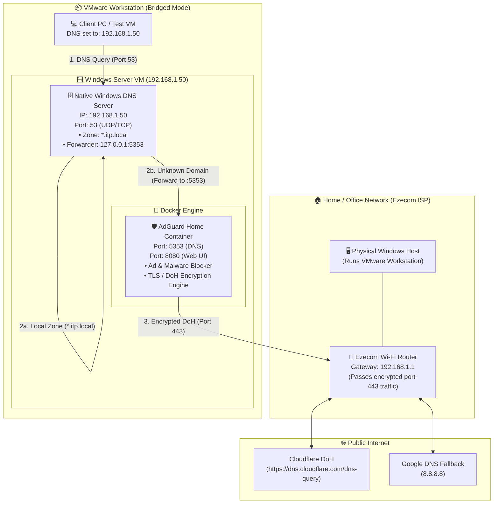
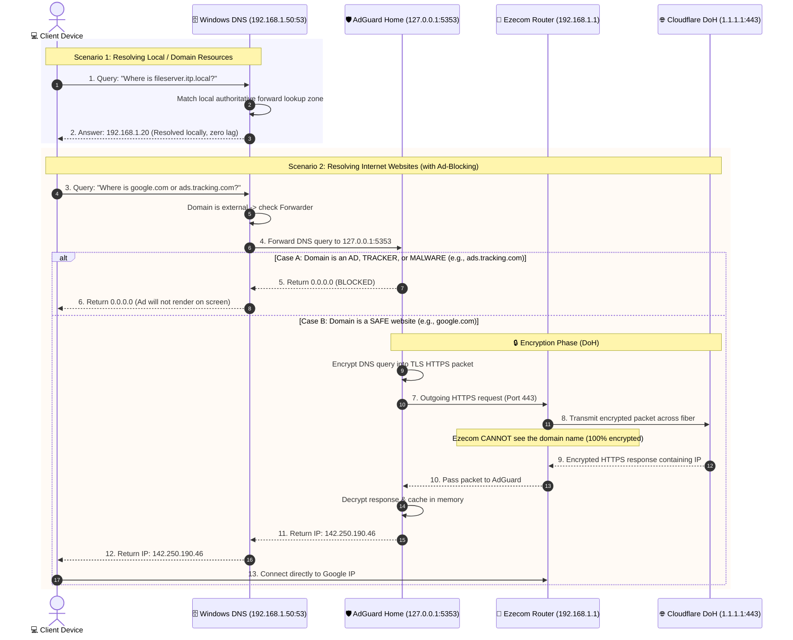

# DNS Architecture & Implementation Guide
**Environment:** Windows Server (VMware Workstation) + AdGuard Home (Docker) + Ezecom ISP  
**Scope:** DNS Only Setup (Native Windows DNS + AdGuard Home DoH)

---

## 1. Architecture Overview

This architecture implements a two-tier hybrid DNS solution:
1. **Tier 1 (Internal & Active Directory):** Native Windows Server DNS listening on standard port `53`. It resolves all local domain names (`*.itp.local`) and Active Directory records.
2. **Tier 2 (Security, Ad-Blocking & Privacy):** AdGuard Home running inside Docker listening on port `5353`. It receives forwarded external queries from Windows DNS, blocks ads/malware, and encrypts outgoing requests using **DNS-over-HTTPS (DoH)** to Cloudflare.
3. **ISP Gateway:** Your Ezecom router (`192.168.1.1`) routes the encrypted HTTPS packets to Cloudflare without being able to see what domains you are looking up.

---

## 2. High-Level Component Diagram



---

## 3. Detailed Sequence Diagram (Query Resolution Flow)



---

## 4. Encryption & Privacy Analysis

| Traffic Segment | Protocol / Port | Encryption State | What Ezecom ISP Can See |
| :--- | :--- | :---: | :--- |
| **Client ➔ Windows DNS** | UDP / TCP `53` | Plain text | *Nothing* (Traffic stays within local LAN / VMware). |
| **Windows DNS ➔ AdGuard** | UDP / TCP `5353` | Plain text | *Nothing* (Traffic stays inside Windows Server loopback). |
| **AdGuard ➔ Ezecom ➔ Cloudflare** | TCP `443` (DoH) | 🔒 **Encrypted (TLS 1.3)** | **Only Cloudflare IP (`1.1.1.1`) and port `443`.** Ezecom **cannot** see domain names, search terms, or DNS answers. |

---

## 5. Port Allocation & Avoiding Conflicts

Because both Windows DNS and AdGuard Home provide DNS services, they must not fight over the default port `53`:

| Service | Host Port | Container Port | Purpose |
| :--- | :---: | :---: | :--- |
| **Windows DNS Server** | `53` | — | Receives DNS queries from all client machines. |
| **AdGuard Home (DNS)** | `5353` | `53` | Receives forwarded queries from Windows DNS only. |
| **AdGuard Home (Initial Wizard)** | `3000` | `3000` | First-time account creation setup. |
| **AdGuard Home (Web Admin)** | `8080` | `80` | Dashboard, query logs, blocklists. |

---

## 6. Implementation Steps (DNS Only)

### Step 1: Configure VMware Workstation
1. Open VMware Workstation, right-click Windows Server VM ➔ **Settings**.
2. Under **Processors**, enable **"Virtualize Intel VT-x/EPT or AMD-V/RVI"** (required for Docker inside VM).
3. Under **Network Adapter**, choose **Bridged**.
4. Boot the Windows Server VM and set a static IP:
   * **IP Address:** `192.168.1.50`
   * **Subnet Mask:** `255.255.255.0`
   * **Default Gateway:** `192.168.1.1` (Ezecom Router)
   * **Preferred DNS:** `127.0.0.1`

---

### Step 2: Deploy AdGuard Home in Docker

Create directory `C:\adguard` and create `C:\adguard\docker-compose.yml`:

```yaml
version: '3.8'

services:
  adguardhome:
    image: adguard/adguardhome:latest
    container_name: adguardhome
    restart: unless-stopped
    ports:
      # Map host port 5353 to container port 53 to prevent conflict with Windows DNS
      - "5353:53/tcp"
      - "5353:53/udp"
      - "3000:3000/tcp"    # Setup wizard port
      - "8080:80/tcp"      # Web dashboard
    volumes:
      - ./workdir:/opt/adguardhome/work
      - ./confdir:/opt/adguardhome/conf
```

Start the container:
```powershell
cd C:\adguard
docker compose up -d
```

---

### Step 3: Configure AdGuard Upstream (Cloudflare DoH)
1. In your browser, open `http://192.168.1.50:3000` and create the admin user.
2. Log into dashboard at `http://192.168.1.50:8080`.
3. Navigate to **Settings** ➔ **DNS Settings**.
4. In the **Upstream DNS servers** box, enter:
   ```text
   https://dns.cloudflare.com/dns-query
   8.8.8.8
   ```
5. Click **Apply** and verify with **Test upstreams**.

---

### Step 4: Install & Configure Native Windows DNS Role
1. In **Server Manager**, click **Add Roles and Features** ➔ check **DNS Server** ➔ Complete installation.
2. Open **DNS Manager** (`dnsmgmt.msc`).
3. Create your local forward lookup zone (e.g., `itp.local`).
4. Configure Forwarder to point to AdGuard Home:
   * Right-click the server name ➔ **Properties** ➔ **Forwarders** tab.
   * Click **Edit...** and add IP: `127.0.0.1`.
   * Save and apply changes.

---

### Step 5: Verification & Testing

From a client machine (or testing from PowerShell on the server):

```powershell
# 1. Test external domain resolution through Windows DNS:
nslookup google.com 192.168.1.50

# 2. Test ad-blocking functionality (should return 0.0.0.0):
nslookup doubleclick.net 192.168.1.50

# 3. Test local domain record:
nslookup your-server.itp.local 192.168.1.50
```
