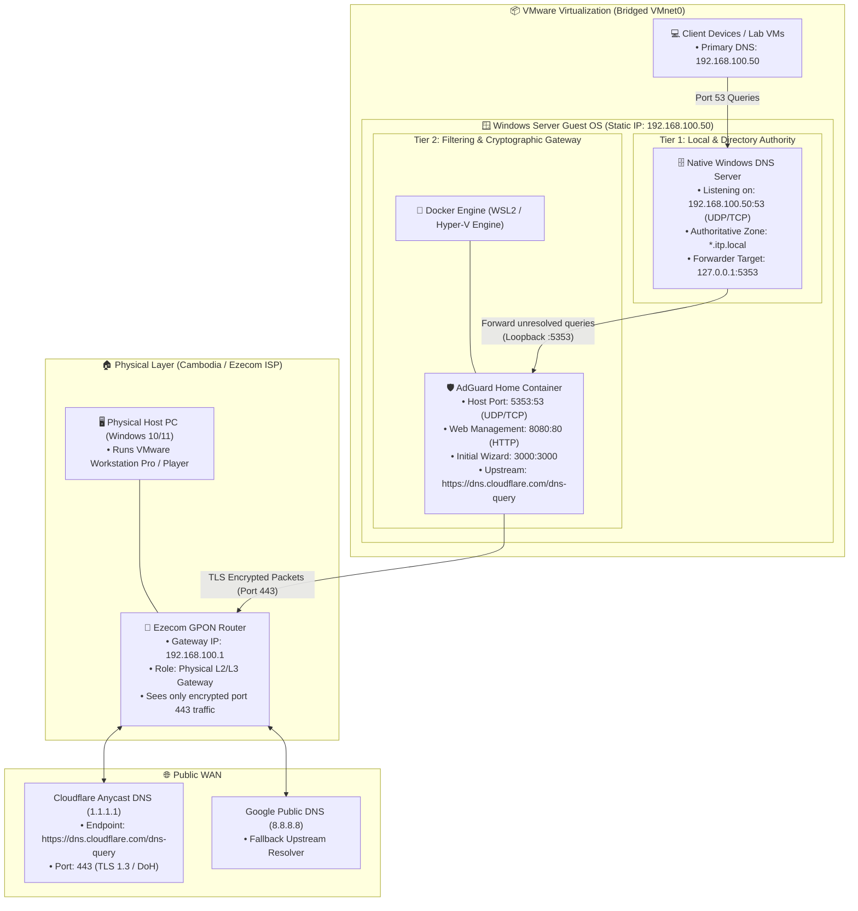
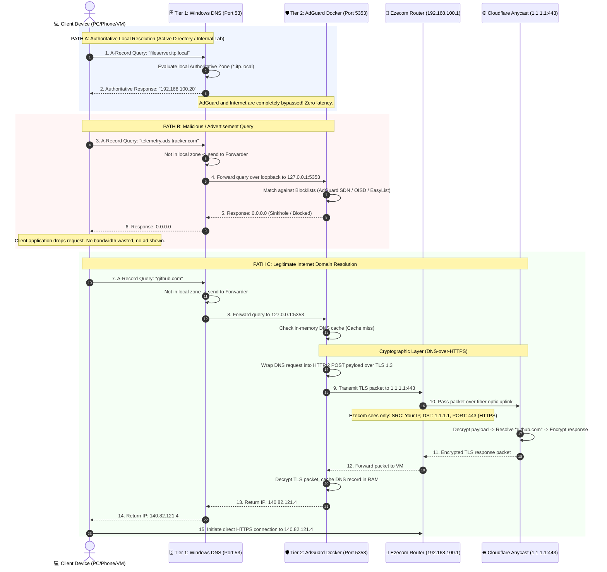

# DNS Architecture, Concepts & System Design

**Target Audience:** Network Engineering, System Administration & Cyber Security  
**Environment:** Windows Server (VMware Workstation) + AdGuard Home (Docker) + Ezecom ISP ($15/month Home Fiber)  
**Document Purpose:** In-depth theoretical concepts, architecture design, cryptographic flow, and design trade-offs.

---

## 1. System Vision & Core Objectives

When designing a modern enterprise or lab network on Windows Server, DNS has three competing requirements:
1. **Directory Integrity & Local Resolution:** Active Directory (AD DS), Windows Domain logons, and local service discovery require strict adherence to Microsoft DNS standards (SRV records, Kerberos discovery, dynamic registration).
2. **Security & Content Filtering:** Modern networks require perimeter defenses against malware domains, phishing sites, invasive tracking telemetry, and advertisements at the network layer.
3. **Data Privacy & Upstream Encryption:** Traditional DNS queries over UDP port `53` are sent in cleartext, enabling the ISP (Ezecom) or anyone on the wire to log every website visited or redirect queries.

A single DNS server cannot solve all three simultaneously out of the box:
* **Native Windows DNS** is excellent at Active Directory and local resolution, but lacks ad-blocking, threat filtering, and native DNS-over-HTTPS (DoH) forwarding.
* **AdGuard Home / Pi-hole** excels at filtering, ad-blocking, and DoH encryption, but lacks native Active Directory SRV record management and Kerberos integration.

**The Solution:** A **Two-Tier Hybrid DNS Architecture**.

---

## 2. High-Level Component Topology



---

## 3. Deep Dive: DNS Query Lifecycle & State Flow

The following sequence details how the system arbitrates between internal records, filtered threat domains, and valid public domains.



---

## 4. Port Conflict Resolution & Socket Arbitration

### The Core Problem
Under Windows Server, any service implementing DNS will attempt to bind to `0.0.0.0:53` (all interfaces, UDP and TCP).
* If Native Windows DNS starts, it acquires port `53`.
* When Docker attempts to start AdGuard Home with `-p 53:53`, the Windows Host OS rejects the binding with:
  ```text
  Error response from daemon: Ports are not available: exposing port TCP 0.0.0.0:53:
  bind: An attempt was made to access a socket in a way forbidden by its access permissions.
  ```

### The Architectural Strategy
Instead of fighting Windows kernel socket drivers, we decouple port obligations:

```
┌────────────────────────────────────────────────────────┐
│ WINDOWS SERVER OS (192.168.100.50)                     │
│                                                        │
│  [Network Interface: 192.168.100.50:53]                │
│       ▲                                                │
│       │ (Clients connect here)                         │
│       │                                                │
│  ┌────┴──────────────────────────┐                     │
│  │ Native Windows DNS Server     │                     │
│  │ Listening: Port 53            │                     │
│  │ Forwarder: 127.0.0.1:5353     │                     │
│  └────┬──────────────────────────┘                     │
│       │ (Internal loopback query)                      │
│       ▼                                                │
│  [Host Port Mapping: 127.0.0.1:5353]                   │
│       │                                                │
│       ▼ (Docker Port Translation)                      │
│  ┌───────────────────────────────┐                     │
│  │ AdGuard Home Container        │                     │
│  │ Container Port: 53            │                     │
│  └───────────────────────────────┘                     │
└────────────────────────────────────────────────────────┘
```

1. **Windows DNS** remains the sole listener on standard port `53`. All network clients (PCs, phones, VMs) only talk to port `53`.
2. **AdGuard Home** maps host port `5353` ➔ container port `53`.
3. **Windows DNS Forwarder** is configured to query `127.0.0.1` on port `5353`.
4. Result: Zero port collisions, 100% service uptime.

---

## 5. Security & Cryptographic Analysis: DoH vs Ezecom ISP

### Plain DNS (Traditional RFC 1035)
When a computer queries standard DNS:
* Protocol: Unencrypted UDP on port `53`.
* Vulnerability: The query travels in plain human-readable text. Any router, ISP equipment, or middlebox can inspect, log, or spoof the response (DNS Poisoning / Cache Hijacking).
* On Ezecom: ISP administrators or automated deep packet inspection (DPI) appliances can record every domain query associated with your static/PPPoE IP.

### DNS-over-HTTPS (DoH RFC 8484)
In this architecture, AdGuard Home implements DoH to Cloudflare (`https://dns.cloudflare.com/dns-query`):
* Protocol: Encrypted TLS 1.3 connection encapsulated in HTTP/2 on TCP port `443`.
* What leaves your Ezecom router:

| Packet Property | What is Transmitted | Can Ezecom ISP Read It? |
| :--- | :--- | :---: |
| **Source IP** | Your Home Public IP (`119.82.x.x`) | Yes (Required for routing) |
| **Destination IP**| Cloudflare Anycast (`1.1.1.1`) | Yes (Required for routing) |
| **Port** | TCP `443` (Standard HTTPS) | Yes |
| **Domain Requested**| Encrypted binary blob (AES-256-GCM / ChaCha20-Poly1305) | ❌ **No (Cryptographically Secure)** |
| **DNS Response / IP**| Encrypted inside TLS tunnel | ❌ **No (Cannot tamper or spoof)** |

---

## 6. Architecture Comparison Matrix

| Evaluation Criteria | Pure Windows DNS | Pure AdGuard Docker | Hybrid Two-Tier (Our Design) |
| :--- | :---: | :---: | :---: |
| **Active Directory Integration** | ⭐⭐⭐⭐⭐ Native | ⭐ Incompatible | ⭐⭐⭐⭐⭐ Seamless |
| **Network-Wide Ad-Blocking** | ❌ None | ⭐⭐⭐⭐⭐ Built-in | ⭐⭐⭐⭐⭐ Built-in |
| **DoH / Privacy Encryption** | ❌ Complex / No UI | ⭐⭐⭐⭐⭐ Native | ⭐⭐⭐⭐⭐ Native |
| **Web Dashboard & Metrics** | ❌ Old MMC Snap-in | ⭐⭐⭐⭐⭐ Modern Web UI | ⭐⭐⭐⭐⭐ Modern Web UI |
| **Client Configuration Overhead** | ⭐ Zero (Standard 53) | ⭐ Zero (Standard 53) | ⭐ Zero (Standard 53) |
| **Single Point of Failure** | 1 Service | 1 Container | 2 Services (Mitigated by DNS Cache) |

---

## 7. Summary
This architecture achieves **enterprise-grade directory compliance** without sacrificing **modern privacy, ad-blocking, and threat protection**. It isolates external ISP visibility while providing local systems with sub-millisecond authoritative resolution.
